# RDS-Aurora-GlobalDatabase-PosgreSQL-CLI
Aurora Global Database(PosgreSQL)をCLIで作成する手順

以下の構成を作成する。<br>



# 作成手順

## (1)事前設定
### (a) 作業環境の準備
下記を準備します。
* aws-cliのセットアップ
* AdministratorAccessポリシーが付与され実行可能な、aws-cliのProfileの設定
### (b) CLI実行用の事前準備
これ以降のAWS-CLIで共通で利用するパラメータを環境変数で設定しておきます。
```shell
export PROFILE="default" #AdministratorAccess権限のあるプロファイルを指定
export PRIMARY_REGION="ap-northeast-1"    #プライマリ側リージョン指定(この手順では東京リージョン)
export SECONDARY_REGION="ap-northeast-3"  #セカンダリ側リージョン指定(この手順では大阪リージョン)
```
## (2)VPCとClientの作成(CloudFormation利用)
IGWでインターネットアクセス可能で、パブリックアクセス可能なサブネットx3、プライベートなサブネットx3の合計6つのサブネットを所有するVPCを作成します。

### (2)-(a) 共通設定
```shell
KEYNAME="CHANGE_KEY_PAIR_NAME"  #環境に合わせてキーペア名を設定してください。  
```

### (2)-(b) VPC作成
プライマリ側のVPCを作成します。
```shell
aws --profile ${PROFILE} --region ${PRIMARY_REGION} cloudformation create-stack \
    --stack-name Aurora-GlobalDB-VPC \
    --template-body "file://./CFn/vpc-6subnets.yaml" \
    --parameters "file://./CFn/vpc.conf" \
    --capabilities CAPABILITY_IAM ;
```

セカンダリ側のVPCを作成します。
```shell
aws --profile ${PROFILE} --region ${SECONDARY_REGION} cloudformation create-stack \
    --stack-name Aurora-GlobalDB-VPC \
    --template-body "file://./CFn/vpc-6subnets.yaml" \
    --parameters "file://./CFn/vpc.conf" \
    --capabilities CAPABILITY_IAM ;
```

### (2)-(c) Client作成
プライマリ側のClientを作成します。
```shell
#最新のAmazon Linux2のAMI IDを取得します。
AMIID=$(aws --profile ${PROFILE} --region ${PRIMARY_REGION} --output text \
    ec2 describe-images \
        --owners amazon \
        --filters 'Name=name,Values=amzn2-ami-hvm-2.0.????????.?-x86_64-gp2' \
                  'Name=state,Values=available' \
        --query 'reverse(sort_by(Images, &CreationDate))[:1].ImageId' ) ;

#Clientインスタンス作成
CFN_STACK_PARAMETERS='
[
  {
    "ParameterKey": "AmiId",
    "ParameterValue": "'"${AMIID}"'"
  },
  {
    "ParameterKey": "KeyName",
    "ParameterValue": "'"${KEYNAME}"'"
  }
]'

aws --profile ${PROFILE} --region ${PRIMARY_REGION} cloudformation create-stack \
    --stack-name Aurora-GlobalDB-Client \
    --template-body "file://./CFn/client.yaml" \
    --parameters "${CFN_STACK_PARAMETERS}" \
    --capabilities CAPABILITY_IAM ;
```

セカンダリ側のClientを作成します。
```shell
#最新のAmazon Linux2のAMI IDを取得します。
AMIID=$(aws --profile ${PROFILE} --region ${SECONDARY_REGION} --output text \
    ec2 describe-images \
        --owners amazon \
        --filters 'Name=name,Values=amzn2-ami-hvm-2.0.????????.?-x86_64-gp2' \
                  'Name=state,Values=available' \
        --query 'reverse(sort_by(Images, &CreationDate))[:1].ImageId' ) ;

#Clientインスタンス作成
CFN_STACK_PARAMETERS='
[
  {
    "ParameterKey": "AmiId",
    "ParameterValue": "'"${AMIID}"'"
  },
  {
    "ParameterKey": "KeyName",
    "ParameterValue": "'"${KEYNAME}"'"
  }
]'

aws --profile ${PROFILE} --region ${SECONDARY_REGION} cloudformation create-stack \
    --stack-name Aurora-GlobalDB-Client \
    --template-body "file://./CFn/client.yaml" \
    --parameters "${CFN_STACK_PARAMETERS}" \
    --capabilities CAPABILITY_IAM ;
```
### (2)-(d) 設定取得
プライマリリージョンのVP設定情報取得
```shell
#プライマリリージョン
Primary_VpcId=$(aws --profile ${PROFILE} --region ${PRIMARY_REGION} --output text \
    cloudformation describe-stacks \
        --stack-name Aurora-GlobalDB-VPC \
        --query 'Stacks[].Outputs[?OutputKey==`VpcId`].[OutputValue]')
Primary_PrivateSubnet1Id=$(aws --profile ${PROFILE} --region ${PRIMARY_REGION} --output text \
    cloudformation describe-stacks \
        --stack-name Aurora-GlobalDB-VPC \
        --query 'Stacks[].Outputs[?OutputKey==`PrivateSubnet1Id`].[OutputValue]')
Primary_PrivateSubnet2Id=$(aws --profile ${PROFILE} --region ${PRIMARY_REGION} --output text \
    cloudformation describe-stacks \
        --stack-name Aurora-GlobalDB-VPC \
        --query 'Stacks[].Outputs[?OutputKey==`PrivateSubnet2Id`].[OutputValue]')
Primary_PrivateSubnet3Id=$(aws --profile ${PROFILE} --region ${PRIMARY_REGION} --output text \
    cloudformation describe-stacks \
        --stack-name Aurora-GlobalDB-VPC \
        --query 'Stacks[].Outputs[?OutputKey==`PrivateSubnet3Id`].[OutputValue]')
Primary_Client_SGId=$(aws --profile ${PROFILE} --region ${PRIMARY_REGION} --output text \
    cloudformation describe-stacks \
        --stack-name Aurora-GlobalDB-Client \
        --query 'Stacks[].Outputs[?OutputKey==`SGId`].[OutputValue]')

echo -e "Primary_VpcId= $Primary_VpcId\nPrimary_PrivateSubnet1Id = ${Primary_PrivateSubnet1Id}\nPrimary_PrivateSubnet2Id = ${Primary_PrivateSubnet2Id}\nPrimary_PrivateSubnet3Id = ${Primary_PrivateSubnet3Id}\nPrimary_Client_SGId = ${Primary_Client_SGId}"
```
セカンダリリージョンのVP設定情報取得
```shell
#セカンダリリージョン
Secondary_VpcId=$(aws --profile ${PROFILE} --region ${SECONDARY_REGION} --output text \
    cloudformation describe-stacks \
        --stack-name Aurora-GlobalDB-VPC \
        --query 'Stacks[].Outputs[?OutputKey==`VpcId`].[OutputValue]')
Secondary_PrivateSubnet1Id=$(aws --profile ${PROFILE} --region ${SECONDARY_REGION} --output text \
    cloudformation describe-stacks \
        --stack-name Aurora-GlobalDB-VPC \
        --query 'Stacks[].Outputs[?OutputKey==`PrivateSubnet1Id`].[OutputValue]')
Secondary_PrivateSubnet2Id=$(aws --profile ${PROFILE} --region ${SECONDARY_REGION} --output text \
    cloudformation describe-stacks \
        --stack-name Aurora-GlobalDB-VPC \
        --query 'Stacks[].Outputs[?OutputKey==`PrivateSubnet2Id`].[OutputValue]')
Secondary_PrivateSubnet3Id=$(aws --profile ${PROFILE} --region ${SECONDARY_REGION} --output text \
    cloudformation describe-stacks \
        --stack-name Aurora-GlobalDB-VPC \
        --query 'Stacks[].Outputs[?OutputKey==`PrivateSubnet3Id`].[OutputValue]')
Secondary_Client_SGId=$(aws --profile ${PROFILE} --region ${SECONDARY_REGION} --output text \
    cloudformation describe-stacks \
        --stack-name Aurora-GlobalDB-Client \
        --query 'Stacks[].Outputs[?OutputKey==`SGId`].[OutputValue]')

echo -e "Secondary_VpcId= $Secondary_VpcId\nSecondary_PrivateSubnet1Id = ${Secondary_PrivateSubnet1Id}\nSecondary_PrivateSubnet2Id = ${Secondary_PrivateSubnet2Id}\nSecondary_PrivateSubnet3Id = ${Secondary_PrivateSubnet3Id}\nSecondary_Client_SGId = ${Secondary_Client_SGId}"

```

## (3)RDSの事前準備(SG,IAM,KMS)
### (3)-(a) RDS用セキュリティグループ作成
プライマリリージョン
```shell
# RDS用セキュリティーグループ作成
PRIMARY_RDS_SG_ID=$(aws --profile ${PROFILE} --region ${PRIMARY_REGION} --output text \
    ec2 create-security-group \
        --group-name RdsSG \
        --description "Allow ssh" \
        --vpc-id ${Primary_VpcId}) ;

aws --profile ${PROFILE} --region ${PRIMARY_REGION} \
    ec2 create-tags \
        --resources ${PRIMARY_RDS_SG_ID} \
        --tags "Key=Name,Value=AuroraPoC-RdsSG" ;

# RDS用セキュリティーグループにClientからのinboundアクセス許可を追加
aws --profile ${PROFILE} --region ${PRIMARY_REGION} \
    ec2 authorize-security-group-ingress \
        --group-id ${PRIMARY_RDS_SG_ID} \
        --protocol tcp \
        --port 5432 \
        --source-group ${Primary_Client_SGId} ;
```
セカンダリリージョン
```shell
# RDS用セキュリティーグループ作成
SECONDARY_RDS_SG_ID=$(aws --profile ${PROFILE} --region ${SECONDARY_REGION} --output text \
    ec2 create-security-group \
        --group-name RdsSG \
        --description "Allow ssh" \
        --vpc-id ${Secondary_VpcId}) ;

aws --profile ${PROFILE} --region ${SECONDARY_REGION} \
    ec2 create-tags \
        --resources ${SECONDARY_RDS_SG_ID} \
        --tags "Key=Name,Value=AuroraPoC-RdsSG" ;

# RDS用セキュリティーグループにClientからのinboundアクセス許可を追加
aws --profile ${PROFILE} --region ${SECONDARY_REGION} \
    ec2 authorize-security-group-ingress \
        --group-id ${SECONDARY_RDS_SG_ID} \
        --protocol tcp \
        --port 5432 \
        --source-group ${Secondary_Client_SGId} ;
```

### (3)-(b) RDS Aurora 用IAMロール作成
#### (a)拡張モニタリング用IAMロール作成
```shell
POLICY='{
  "Version": "2012-10-17",
  "Statement": [
    {
      "Sid": "",
      "Effect": "Allow",
      "Principal": {
        "Service": "monitoring.rds.amazonaws.com"
      },
      "Action": "sts:AssumeRole"
    }
  ]
}'
#IAMロールの作成
aws --profile ${PROFILE} --region ${PRIMARY_REGION}\
    iam create-role \
        --role-name "RdsEnhancedMonitoringRole" \
        --assume-role-policy-document "${POLICY}" \
        --max-session-duration 43200
#Policyのアタッチ
aws --profile ${PROFILE} --region ${PRIMARY_REGION} \
    iam attach-role-policy \
        --role-name "RdsEnhancedMonitoringRole" \
        --policy-arn arn:aws:iam::aws:policy/service-role/AmazonRDSEnhancedMonitoringRole
```

### (3)-(c) IAMロール情報取得
```shell
# RDS用IAMロールのARN取得
RDS_MONITOR_ROLE_ARN=$(aws --profile ${PROFILE} --region ${PRIMARY_REGION} --output text \
    iam get-role \
        --role-name RdsEnhancedMonitoringRole \
    --query 'Role.Arn' )

echo $RDS_MONITOR_ROLE_ARN
```

### (3)-(d) Aurora暗号化用KMS(CMK)作成
プライマリーリージョン側
```shell
#CMK作成
PRIMARY_KEY_ID=$( \
aws --profile ${PROFILE} --region ${PRIMARY_REGION} --output text \
    kms create-key \
	    --description Key_For_Aurora \
	    --origin AWS_KMS \
	--query 'KeyMetadata.KeyId' )

#エイリアス設定
aws --profile ${PROFILE} --region ${PRIMARY_REGION} \
    kms create-alias \
	    --alias-name alias/Key_For_Aurora \
	    --target-key-id ${PRIMARY_KEY_ID}
```

セカンダリリーリージョン側
```shell
#CMK作成
SECONDARY_KEY_ID=$( \
aws --profile ${PROFILE} --region ${SECONDARY_REGION} --output text \
    kms create-key \
	    --description Key_For_Aurora \
	    --origin AWS_KMS \
	--query 'KeyMetadata.KeyId' )

#エイリアス設定
aws --profile ${PROFILE} --region ${SECONDARY_REGION} \
    kms create-alias \
	    --alias-name alias/Key_For_Aurora \
	    --target-key-id ${SECONDARY_KEY_ID}
```

## (4)RDS Aurora PosgreSQLの作成
### (4)-(a) 設定
```shell
#サブネットグループ
RDS_SUBNETGROUP_NAME="aurorapoc-subnetgroup"       #全て小文字で設定
#パラメータグループ
RDS_PARAMETERGROUP_NAME="aurorapoc-parametergroup" #全て小文字で設定
RDS_PARAMETER_GROUP_FAMILY="aurora-postgresql13"
#DBクラスター/エンジン/バージョン
RDS_GLOBALDB_NAME='aurorapoc-globaldb-1'
RDS_PRIMARY_DBCLUSTER_NAME="${RDS_GLOBALDB_NAME}-primary-cluster"
RDS_SECONDARY_DBCLUSTER_NAME="${RDS_GLOBALDB_NAME}-secondary-cluster"
RDS_ENGINE_NAME='aurora-postgresql'
RDS_ENGINE_VERSION='13.4'
#DB設定
RDS_DB_NAME='globaldbpoc'
RDS_USER_NAME='root'
RDS_USER_PASS='dbPassword#'
#DBインスタンス設定
RDS_INSTANCE_CLASS='db.r5.large'
RDS_STORAGE_SIZE='100'
```
### (4)-(b) Globalクラスター作成
グローバルデータベース用のクラスターを作成します。グローバルクラスターは特定のリージョンに固定されないため、どこのリージョンで作成しても構いません。作成されたグローバルクラスターはどこのリポジトリからも参照可能です。
```shell
aws --profile ${PROFILE} --region ${PRIMARY_REGION} \
    rds create-global-cluster \
        --global-cluster-identifier "${RDS_GLOBALDB_NAME}" \
        --engine "${RDS_ENGINE_NAME}" \
        --engine-version "${RDS_ENGINE_VERSION}" \
        --database-name "${RDS_DB_NAME}" \
        --storage-encrypted \
        --no-deletion-protection 
```

### (4)-(c) (プライマリー側)DBクラスター作成
#### (i) (プライマリー側)サブネットグループ作成
```shell
aws --profile ${PROFILE} --region ${PRIMARY_REGION} --no-cli-pager \
    rds create-db-subnet-group \
        --db-subnet-group-name "${RDS_SUBNETGROUP_NAME}" \
        --db-subnet-group-descriptio "PoC for GlobalDatabase" \
        --subnet-ids ${Primary_PrivateSubnet1Id} ${Primary_PrivateSubnet2Id} ${Primary_PrivateSubnet3Id};
```
#### (ii) (プライマリー側)パラメータグループ作成
```shell
#クラスター パラメータグループの作成
aws --profile ${PROFILE} --region ${PRIMARY_REGION} \
    rds create-db-cluster-parameter-group \
        --db-cluster-parameter-group-name "${RDS_PARAMETERGROUP_NAME}" \
        --db-parameter-group-family "${RDS_PARAMETER_GROUP_FAMILY}" \
        --description  "PoC for GlobalDatabase"

#パラメータグループの作成
aws --profile ${PROFILE} --region ${PRIMARY_REGION} \
    rds create-db-parameter-group \
        --db-parameter-group-name "${RDS_PARAMETERGROUP_NAME}" \
        --db-parameter-group-family "${RDS_PARAMETER_GROUP_FAMILY}" \
        --description  "PoC for GlobalDatabase"
```
#### (iii) (プライマリー側)DBクラスターの作成
```shell
#DBクラスターの作成
aws --profile ${PROFILE} --region ${PRIMARY_REGION} --no-cli-pager \
    rds create-db-cluster \
        --global-cluster-identifier "${RDS_GLOBALDB_NAME}" \
        --db-cluster-identifier "${RDS_PRIMARY_DBCLUSTER_NAME}" \
        --engine "${RDS_ENGINE_NAME}" \
        --engine-version "${RDS_ENGINE_VERSION}" \
        --db-cluster-parameter-group-name "${RDS_PARAMETERGROUP_NAME}" \
        --vpc-security-group-ids "${PRIMARY_RDS_SG_ID}" \
        --db-subnet-group-name "${RDS_SUBNETGROUP_NAME}" \
        --kms-key-id  "${PRIMARY_KEY_ID}" \
        --master-username "${RDS_USER_NAME}" \
        --master-user-password "${RDS_USER_PASS}" \
        --backup-retention-period 3 \
        --preferred-backup-window "15:30-16:00" \
        --preferred-maintenance-window "Mon:15:00-Mon:15:30" ;

#DBクラスター作成完了までのWait(bashのみ。zshの場合は、"[ $STATUS == "available" ]"を"[ $STATUS = "available" ]"に修正)
while true;
do
    STATUS=$(aws --profile ${PROFILE} --region ${PRIMARY_REGION} --output text \
        rds describe-db-clusters \
            --db-cluster-identifier "${RDS_PRIMARY_DBCLUSTER_NAME}" \
        --query 'DBClusters[].Status'; );
    if [ $STATUS == "available" ]; then
        break
    fi
    echo "STATUS=${STATUS}. waiting..."
    sleep 1
done
echo 'Done!!!!!'
```

#### (iv) (プライマリー側)DBインスタンスの作成
DBサブネットグループに登録されている各AZごとに、DBインスタンスを作成します。
```shell
#DBインスタンスの作成
for az in $(aws --profile ${PROFILE} --region ${PRIMARY_REGION} --output text \
        rds describe-db-subnet-groups \
        --query 'DBSubnetGroups[?DBSubnetGroupName==`'"${RDS_SUBNETGROUP_NAME}"'`].Subnets[].SubnetAvailabilityZone.Name');
do
    azlabel="$(echo ${az} | cut -f 3 -d '-')"
    aws --profile ${PROFILE} --region ${PRIMARY_REGION} --no-cli-pager \
        rds create-db-instance \
            --db-cluster-identifier "${RDS_PRIMARY_DBCLUSTER_NAME}" \
            --db-instance-identifier "${RDS_PRIMARY_DBCLUSTER_NAME}-${azlabel}" \
            --availability-zone "${az}" \
            --db-instance-class "${RDS_INSTANCE_CLASS}" \
            --engine "${RDS_ENGINE_NAME}" \
            --engine-version "${RDS_ENGINE_VERSION}" \
            --db-parameter-group-name "${RDS_PARAMETERGROUP_NAME}" \
            --no-publicly-accessible \
            --no-auto-minor-version-upgrade \
            --preferred-maintenance-window "Mon:15:00-Mon:15:30" \
            --monitoring-interval 1 \
            --monitoring-role-arn ${RDS_MONITOR_ROLE_ARN} ;
done
```

### (4)-(d) (セカンダリ側)DBクラスター作成

#### (i) (セカンダリ側)サブネットグループ作成
```shell
aws --profile ${PROFILE} --region ${SECONDARY_REGION} --no-cli-pager \
    rds create-db-subnet-group \
        --db-subnet-group-name "${RDS_SUBNETGROUP_NAME}" \
        --db-subnet-group-descriptio "PoC for GlobalDatabase" \
        --subnet-ids ${Secondary_PrivateSubnet1Id} ${Secondary_PrivateSubnet2Id} ${Secondary_PrivateSubnet3Id};
```

#### (ii) (セカンダリ側)パラメータグループ作成
```shell
#クラスター パラメータグループの作成
aws --profile ${PROFILE} --region ${SECONDARY_REGION} \
    rds create-db-cluster-parameter-group \
        --db-cluster-parameter-group-name "${RDS_PARAMETERGROUP_NAME}" \
        --db-parameter-group-family "${RDS_PARAMETER_GROUP_FAMILY}" \
        --description  "PoC for GlobalDatabase"

#パラメータグループの作成
aws --profile ${PROFILE} --region ${SECONDARY_REGION} \
    rds create-db-parameter-group \
        --db-parameter-group-name "${RDS_PARAMETERGROUP_NAME}" \
        --db-parameter-group-family "${RDS_PARAMETER_GROUP_FAMILY}" \
        --description  "PoC for GlobalDatabase"
```

#### (iii) (セカンダリ側)DBクラスターの作成
```shell
#DBクラスターの作成
aws --profile ${PROFILE} --region ${SECONDARY_REGION} --no-cli-pager \
    rds create-db-cluster \
        --global-cluster-identifier "${RDS_GLOBALDB_NAME}" \
        --db-cluster-identifier "${RDS_SECONDARY_DBCLUSTER_NAME}" \
        --engine "${RDS_ENGINE_NAME}" \
        --engine-version "${RDS_ENGINE_VERSION}" \
        --db-cluster-parameter-group-name "${RDS_PARAMETERGROUP_NAME}" \
        --vpc-security-group-ids "${SECONDARY_RDS_SG_ID}" \
        --db-subnet-group-name "${RDS_SUBNETGROUP_NAME}" \
        --kms-key-id "${SECONDARY_KEY_ID}" \
        --backup-retention-period 3 \
        --preferred-backup-window "17:30-18:00" \
        --preferred-maintenance-window "Mon:19:00-Mon:19:30" ;

#DBクラスター作成完了までのWait(bashのみ。zshの場合は、"[ $STATUS == "available" ]"を"[ $STATUS = "available" ]"に修正)
while true;
do
    STATUS=$(aws --profile ${PROFILE} --region ${SECONDARY_REGION} --output text \
        rds describe-db-clusters \
            --db-cluster-identifier "${RDS_SECONDARY_DBCLUSTER_NAME}" \
        --query 'DBClusters[].Status'; );
    if [ $STATUS == "available" ]; then
        break
    fi
    echo "STATUS=${STATUS}. waiting..."
    sleep 1
done
echo 'Done!!!!!'
```

#### (iv) (セカンダリ側)DBインスタンスの作成
DBサブネットグループに登録されている各AZごとに、DBインスタンスを作成します。
```shell
#DBインスタンスの作成
for az in $(aws --profile ${PROFILE} --region ${SECONDARY_REGION} --output text \
        rds describe-db-subnet-groups \
        --query 'DBSubnetGroups[?DBSubnetGroupName==`'"${RDS_SUBNETGROUP_NAME}"'`].Subnets[].SubnetAvailabilityZone.Name');
do
    azlabel="$(echo ${az} | cut -f 3 -d '-')"
    aws --profile ${PROFILE} --region ${SECONDARY_REGION} --no-cli-pager \
        rds create-db-instance \
            --db-cluster-identifier "${RDS_SECONDARY_DBCLUSTER_NAME}" \
            --db-instance-identifier "${RDS_SECONDARY_DBCLUSTER_NAME}-${azlabel}" \
            --availability-zone "${az}" \
            --db-instance-class "${RDS_INSTANCE_CLASS}" \
            --engine "${RDS_ENGINE_NAME}" \
            --engine-version "${RDS_ENGINE_VERSION}" \
            --db-parameter-group-name "${RDS_PARAMETERGROUP_NAME}" \
            --no-publicly-accessible \
            --no-auto-minor-version-upgrade \
            --preferred-maintenance-window "Mon:19:00-Mon:19:30" \
            --monitoring-interval 1 \
            --monitoring-role-arn ${RDS_MONITOR_ROLE_ARN} ;
done
```


## (6)PosgreSQL接続テスト
### (a) BastionインスタンスのPublic IP取得とsshログイン
```shell
BastionIP=$(aws --profile ${PROFILE} --output text \
    ec2 describe-instances \
        --filter "Name=tag:Name,Values=Bastion" "Name=instance-state-name,Values=running"  \
    --query 'Reservations[].Instances[].NetworkInterfaces[].Association.PublicIp' \
)
ssh ec2-user@${BastionIP}
```
### (b) BastionサーバからのAurora接続＆動作テスト
```shell
RDS_ENDPOINT="xxxx"
RDS_DB_NAME='multiaztestdb'
RDS_USER_NAME='root'
RDS_USER_PASS='dbPassword#'

#postgreSQLのインストール
sudo yum -y install postgresql

#接続テスト
export PGPASSWORD=${RDS_USER_PASS}
psql -h ${RDS_ENDPOINT} -d ${RDS_DB_NAME} -U ${RDS_USER_NAME}

SQL> SELECT version();

#テーブル作成
SQL> 
CREATE TABLE testtbl(
    id SERIAL NOT NULL,
    name VARCHAR(20) NOT NULL,
    age integer NOT NULL,
    PRIMARY KEY(id)
);

SQL> \d testtbl

#データインサート
SQL> INSERT INTO testtbl (name, age) VALUES ('鈴木',20);
SQL> INSERT INTO testtbl (name, age) VALUES ('田中',31);
SQL> INSERT INTO testtbl (name, age) VALUES ('安田',35);
SQL> 
commit;

#データ確認
SQL> select * from testtbl;

#終了
\q
```
### (c) フェイルオーバーテスト
作業用コンソールでを実行
```shell
export PROFILE=<設定したプロファイル名称を指定。デフォルトの場合はdefaultを設定>

#フェイルオーバーの実行(1cにフェイルオーバー)
aws --profile ${PROFILE} \
    rds failover-db-cluster \
        --db-cluster-identifier "multi-azs-test-aurora-posgre-cluster" \
        --target-db-instance-identifier "multi-azs-test-aurora-posgre-instance-1c"


#フェイルオーバーの実行(1aにフェイルオーバー、切り戻し)
aws --profile ${PROFILE} \
    rds failover-db-cluster \
        --db-cluster-identifier "multi-azs-test-aurora-posgre-cluster" \
        --target-db-instance-identifier "multi-azs-test-aurora-posgre-instance-1a"
```

## (7)インスタンス削除、再作成テスト
### (a) 既存DBインスタンスの削除
```shell
export PROFILE=<設定したプロファイル名称を指定。デフォルトの場合はdefaultを設定>

#インスタンス削除(1台目:1a)
aws --profile ${PROFILE} \
    rds delete-db-instance \
        --db-instance-identifier "multi-azs-test-aurora-posgre-instance-1a" ;

#インスタンス削除(2台目:1c)
aws --profile ${PROFILE} \
    rds delete-db-instance \
        --db-instance-identifier "multi-azs-test-aurora-posgre-instance-1c" ;

#インスタンス削除(3台目:1d)
aws --profile ${PROFILE} \
    rds delete-db-instance \
        --db-instance-identifier "multi-azs-test-aurora-posgre-instance-1d" ;

#インスタンス削除完了の確認
#下記を実行して、インスタンスがなくなったことを確認
aws --profile ${PROFILE} \
    rds describe-db-clusters \
        --db-cluster-identifier "multi-azs-test-aurora-posgre-cluster" \
    --query 'DBClusters[].DBClusterMembers'

```
### (b) インスタンスの再追加
```shell

#DBインスタンスの作成(3台目 - 1d)
aws --profile ${PROFILE} \
    rds create-db-instance \
        --db-instance-identifier "multi-azs-test-aurora-posgre-instance-1d" \
        --availability-zone "ap-northeast-1d" \
        --db-instance-class ${RDS_INSTANCE_CLASS} \
        --engine ${RDS_ENGINE_NAME} \
        --engine-version ${RDS_ENGINE_VERSION} \
        --db-parameter-group-name "multiazs-test-parametergrp" \
        --no-auto-minor-version-upgrade \
        --no-publicly-accessible \
        --db-cluster-identifier "multi-azs-test-aurora-posgre-cluster" \
        --preferred-maintenance-window "Mon:15:00-Mon:15:30" \
        --monitoring-interval 1 \
        --monitoring-role-arn ${RDS_MONITOR_ROLE_ARN} ;
```
インスタンス起動後に、接続可能か確認。
```shell
BastionIP=$(aws --profile ${PROFILE} --output text \
    ec2 describe-instances \
        --filter "Name=tag:Name,Values=Bastion" "Name=instance-state-name,Values=running"  \
    --query 'Reservations[].Instances[].NetworkInterfaces[].Association.PublicIp' \
)
ssh ec2-user@${BastionIP}

#SSH接続後
RDS_ENDPOINT="xxxx"
RDS_DB_NAME='multiaztestdb'
RDS_USER_NAME='root'
RDS_USER_PASS='dbPassword#'

#接続テスト
export PGPASSWORD=${RDS_USER_PASS}
psql -h ${RDS_ENDPOINT} -d ${RDS_DB_NAME} -U ${RDS_USER_NAME}


#データ確認
SQL> select * from testtbl;

#終了
\q
```